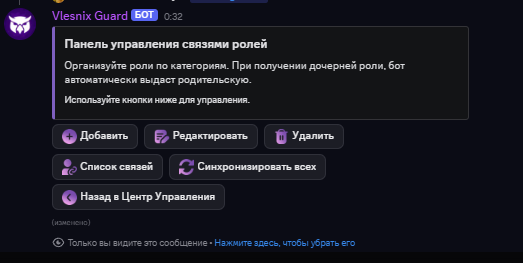

# Модерация

#### Управление наказаниями

| Команда                            | Описание                                                    | Права по умолчанию |
| ---------------------------------- | ----------------------------------------------------------- | ------------------ |
| `/ban <user> <time> <reason>`      | Забанить пользователя. Время может быть `1h`, `7d`, `perm`. | `Ban Members`      |
| `/unban <user> <reason>`           | Разбанить пользователя.                                     | `Ban Members`      |
| `/kick <user> <reason>`            | Выгнать пользователя с сервера.                             | `Kick Members`     |
| `/timeout <user> <time> <reason>`  | Выдать пользователю тайм-аут (мут).                         | `Moderate Members` |
| `/untimeout <user> <reason>`       | Снять тайм-аут с пользователя.                              | `Moderate Members` |
| `/restrict <user> <time> <reason>` | Ограничить пользователя, забрав у него все роли.            | `Manage Roles`     |
| `/unrestrict <user> <reason>`      | Снять ограничение, вернув роли.                             | `Manage Roles`     |
| `/punish history [user]`           | Посмотреть историю наказаний пользователя.                  | `Manage Messages`  |

#### Утилиты модерации

| Команда                                | Описание                                                                                 | Права по умолчанию |
| -------------------------------------- | ---------------------------------------------------------------------------------------- | ------------------ |
| `/clear <amount> [filters]`            | Удаление сообщений (до 1000) с фильтрами по пользователю, содержанию и наличию вложений. | `Manage Messages`  |
| `/slowmode <time> [channel]`           | Установка замедленного режима в канале. `0` для отключения.                              | `Manage Channels`  |
| `/channel lock [channel] [reason]`     | Заблокировать отправку сообщений в канале для всех, кроме модераторов.                   | `Manage Channels`  |
| `/channel unlock [channel] [reason]`   | Разблокировать канал.                                                                    | `Manage Channels`  |
| `/nickname set <user> [new_name]`      | Изменить или сбросить никнейм пользователя.                                              | `Manage Nicknames` |
| `/nickname history <user>`             | Показать историю смены никнеймов пользователя.                                           | `Manage Nicknames` |
| `/mrole <action> <user> <role>`        | Выдать или снять роль с пользователя (для модераторов).                                  | `Manage Roles`     |
| `/rinvite <user> <channel> <duration>` | Выдать временный доступ к приватному голосовому каналу.                                  | `Moderate Members` |

#### Управление модераторами

Этот блок команд предназначен для старшей администрации и позволяет полностью контролировать состав модераторов, их профили, статистику и наказания.


Большинство этих команд работают только при включенной **системе уровней доступа** в настройках модерации (/settings moderation). Если система выключена, у этих команд не будет данных для работы.


| Команда                          | Описание                                                                                           | Пример использования                                                              |
| -------------------------------- | -------------------------------------------------------------------------------------------------- | --------------------------------------------------------------------------------- |
| /modermanage punish              | Выдать или снять выговор/предупреждение модератору.                                                | /modermanage punish user:@модератор type:выговор value:1 reason:Пропуск нарушения |
| /modermanage setlvl              | Установить модератору новый уровень доступа (от 1 до 5).                                           | /modermanage setlvl user:@модератор level:2                                       |
| /modermanage bonus               | Начислить или списать бонусные баллы модератору.                                                   | /modermanage bonus user:@модератор value:10 reason:Хорошая работа                 |
| /modermanage setpost             | Установить или изменить текстовую должность модератора.                                            | /modermanage setpost user:@модератор post:Следящий за чатом                       |
| /modermanage setcontact          | Обновить контактные данные модератора (например, VK или TG).                                       | /modermanage setcontact user:@модератор field:vk value:https://vk.com/...         |
| /modermanage setprefix           | Установить префикс, который будет отображаться в профиле модератора.                               | /modermanage setprefix user:@модератор prefix:Ст.Мод                              |
| /modermanage setpromotion-date   | Установить дату последнего повышения модератора.                                                   | /modermanage setpromotion-date user:@модератор date:25.12.2024                    |
| /modermanage setappointment-date | Установить дату назначения на пост модератора.                                                     | /modermanage setappointment-date user:@модератор date:01.01.2024                  |
| /modermanage setappointment-type | Установить способ, которым модератор попал на пост (обзвон, заявка и т.д.).                        | /modermanage setappointment-type user:@модератор appointment\_type:обзвон         |
| /modreg                          | Зарегистрировать нового пользователя как модератора 1-го уровня.                                   | /modreg user:@новый\_модер (откроется модальное окно для контактов)               |
| /fire                            | Снять пользователя с поста модератора, обнулив его уровень доступа.                                | /fire user:@модератор reason:ПСЖ                                                  |
| /recovery                        | Восстановить снятого модератора, вернув ему 1-й уровень доступа.                                   | /recovery user:@бывший\_модер                                                     |
| /moderstats                      | Показать подробную статистику модератора (должность, контакты, выговоры, история действий и т.д.). | /moderstats user:@модератор                                                       |

#### Настройка модуля

Для настройки модуля используйте команду `/settings moderation`.

<figure><figcaption></figcaption></figure>

Доступны следующие параметры:

* **Каналы:** Настройка информационного канала для уведомлений о действиях модераторов.
* **Роли:** Привязка ролей Discord к уровням модерации (`Младший`, `Модератор`, `Старший`).
* **Лимиты:** Установка максимального количества выговоров, предупреждений и бонусов.
* **Система доступа:** Включение/выключение системы уровней доступа. При выключении права на команды определяются стандартными правами Discord.
* **Настройка /mrole:** Гибкая настройка прав для команды `/mrole`, позволяющая указать, какая роль может управлять какими другими ролями.
