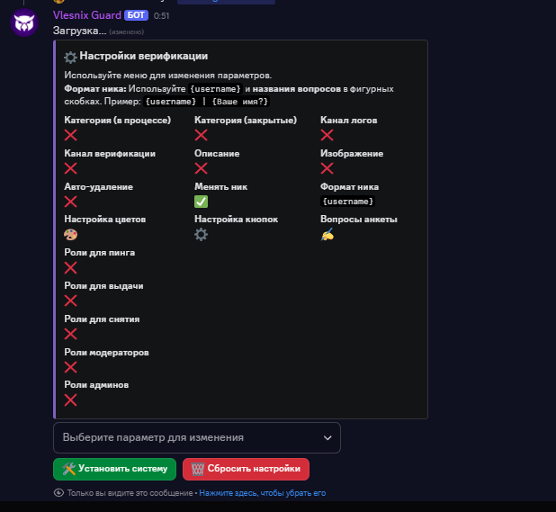

# Управление ролями

#### Как получить доступ?

Для входа в Центр управления ролями используйте команду `/settings roles`.

<figure><figcaption></figcaption></figure>

#### 1. Автоматические роли и Восстановление

Эти два раздела позволяют настроить, что происходит с ролями участников, когда они приходят на сервер.

**Автоматические роли**

Настройка ролей, которые выдаются пользователям **автоматически при первом входе** на сервер. Это идеально подходит для выдачи базовой роли "Участник" или для разделения потоков новых пользователей.

* **Как найти:** `/settings roles` -> кнопка `Авто-роли`

**Восстановление ролей и никнейма**

Здесь настраивается поведение для **вернувшихся** участников.

* **Восстановление ролей:** Если участник вышел с сервера, а потом вернулся, бот может автоматически вернуть ему все роли, которые у него были. Вы можете настроить "роли-исключения", которые не будут восстанавливаться (например, роли за буст или временные роли).
* **Восстановление никнейма:** Бот также может вернуть пользователю его прежний никнейм.
* **Как найти:** `/settings roles` -> кнопка `Восстановление ролей`

***

#### 2. Временные роли

Модуль для выдачи ролей на определенный срок. Идеально подходит для наград, доступа к временным событиям или в качестве мягкого наказания.

* **Как найти настройки:** `/settings roles` -> кнопка `Временные роли`

**Команды**

| Команда            | Описание                                                  | Пример использования                                                 |
| ------------------ | --------------------------------------------------------- | -------------------------------------------------------------------- |
| `/temprole add`    | Назначить пользователю временную роль.                    | `/temprole add user:@пользователь role:@роль time:7d reason:Награда` |
| `/temprole remove` | Досрочно снять временную роль.                            | `/temprole remove user:@пользователь role:@роль reason:Нарушение`    |
| `/temprole extend` | Продлить срок действия временной роли.                    | `/temprole extend user:@пользователь role:@роль time:3d`             |
| `/temprole list`   | Показать список всех активных временных ролей на сервере. | `/temprole list user:@пользователь`                                  |

***

#### 3. Связанные роли (Иерархия)

Настройте автоматическую выдачу "родительских" ролей при получении любой из "дочерних".

**Пример:** Вы можете настроить так, чтобы при получении любой роли за категорий (`Особые роли`, `` `Базовые роли` ``и т.д.) пользователю автоматически выдавалась общая роль `Активный участник`.

* **Как найти:** `/settings roles` -> кнопка `Связанные роли`

<figure><figcaption></figcaption></figure>
